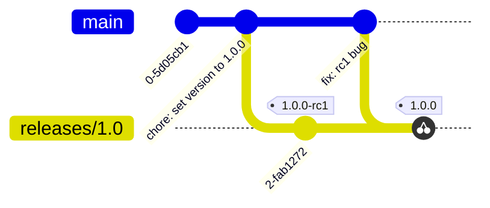
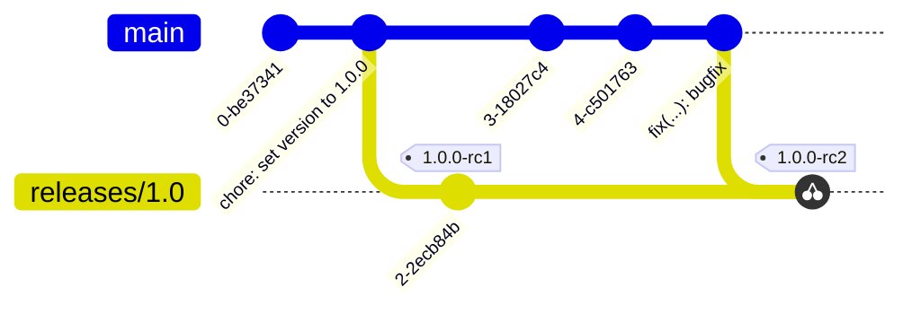

# ADR-0001 - Release Process

## Feature
N/A

## Status
Accepted

## Context
This repository is new, and as such has not had a formal release process defined.
In order to achieve predictable, reliable releases, the following will need to
be defined:
* Release Cadence
* Branching Strategy
* Release Candidate Process

## Decision
### Release Cadence
#### Regular Releases
The Ansible Collection will be released simultaneously with the Sysdig Agent.
This will allow users an easy path to upgrade their environments using existing
playbooks.

Releasing on the same cadence as the Agent also means that development on the 
Collection that occurs between Agent releases is always open and new content is
free to land on the `main` branch without fear releasing content in the Collection
before the Agent that supports that content. By allowing new content to merge
to `main` as it is completed, we reduce the operational complexities encountered
at release time that would otherwise arise from a flurry of merges right before a
new release branches.

#### Hotfixes
Unlike regular releases, hotfix releases will be created and released whenever
they are required without hesitation.

### Branching Strategy
All development in the Collection will be done on the `main` branch. That is to say,
all new features and bugfixes must hit `main` before being cherry-picked to another branch.

#### Major Releases
When a new major version release is to be made a corresponding branch will be
created with the following format, `releases/<major_version>.0`.
Prior to creating the release branch, a commit setting the upcoming Collection version in
the [galaxy.yaml](https://github.com/sysdiglabs/agent-ansible-collection/blob/main/galaxy.yml)
file must be made.

#### Minor Releases
Minor releases will get their own branches off of the `main` branch similar to the major
releases, and will follow the same `releases/<major_version>.<minor_version>` naming scheme.
This will allow easier code management as opposed to branching off of the major
release branch by reducing the number of cherry-picks required for either new content or
bugfixes coming in after the minor release has branched.
Similarly to the major releases, when a new minor release branch is created, a commit adjusting
the Collection version in the [galaxy.yaml](https://github.com/sysdiglabs/agent-ansible-collection/blob/main/galaxy.yml)
file must be made.

#### Hotfix Releases
Hotfix releases will not get their own branches, but will instead rely on
placing a new release tag with the appropriate hotfix version on the relevant
branch. When a hotfix is needed the fix will first be merged to `main`, then
will be cherry-picked to the appropriate major and/or minor release branch(es).
Along with the hotfix content, a commit adjusting the version field in the
Collection's [galaxy.yaml](https://github.com/sysdiglabs/agent-ansible-collection/blob/main/galaxy.yml)
file must be made on the relevant release branch(es).

The process will look like the following:

### Release Candidate Process
The release process will involve the generation and testing of release
candidates. Release candidates of the Collection will be indicated by the use
of a special release candidate tag. The format of such tags is defined in
[adr-0002](https://github.com/sysdiglabs/agent-ansible-collection/blob/main/docs/decisions/adr-0002-tag-naming.md).
The number following `rc` will increment by one for each subsequent release candidate
and a new tag will be placed accordingly

After successful validation of the Collection, a release tag will be placed at
the same commit as the most recent rc tag. The release tag will then be used
to ingest the Collection content by the Ansible Galaxy.

