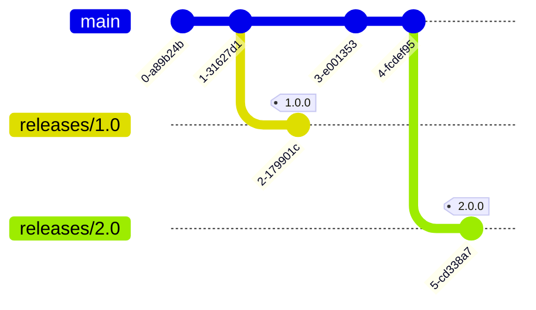
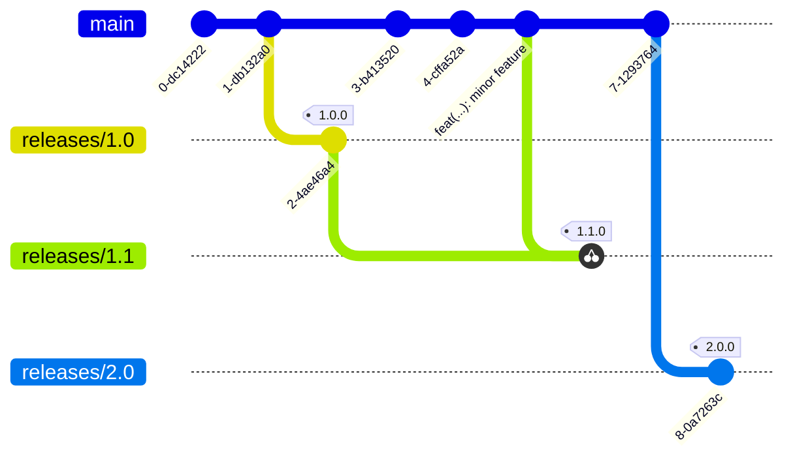
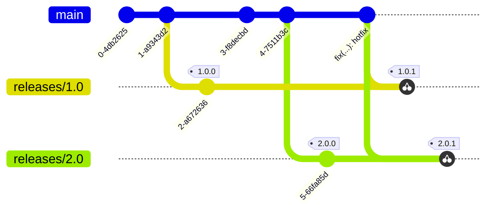
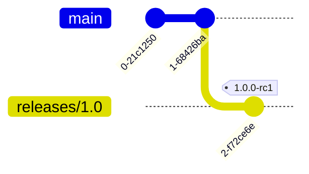
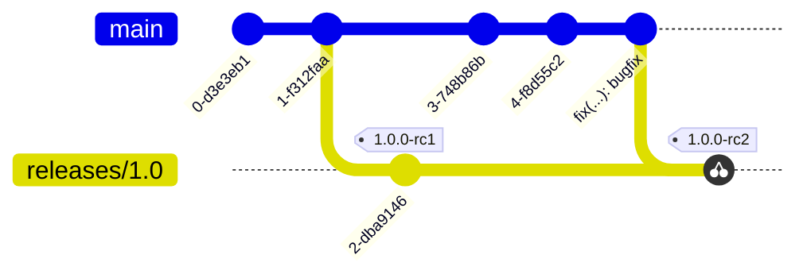
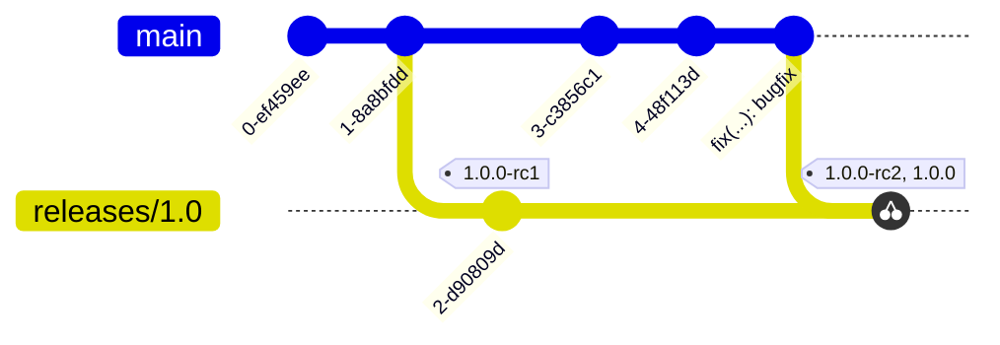

# ADR-0001 - Release Process

## Feature
N/A

## Status
Accepted

## Context
This repository is new, and as such has not had a formal release process defined.
In order to achieve predictable, reliable releases, the following will need to
be defined:
* Release Cadence
* Branching Strategy
* Release Candidate Process

## Decision
### Release Cadence
#### Regular Releases
The Ansible Collection will be release at the same time as the Sysdig Agent.
This will allow users to upgrade the Ansible Collection and be able to deploy
the newly released version of the Agent with existing playbooks.

Releasing simultaneously with the Agent also means that all new feature
development done to the Collection between Agent releases will be 'held' until
the next Agent release. This method ensures that feature development on the
Collection to support new Agent functionality does not need to be held back on
branches and merged all at the same time when the Agent is released. By
allowing new content to merge to `main` when completed we will reduce the
operational complexities encountered at release time.

#### Hotfixes
Unlike regular releases, hotfix releases will be created and released whenever
they are required without hesitation.

### Branching Strategy
#### Major Releases
The Ansible Collection will do all development on the `main` branch. All new
commits must first be merged to the `main` branch before anywhere else. When
a new major version release is to be made a corresponding branch will be
created with the following format, `releases/<major_version>.<minor_version>`.

#### Minor Releases
Minor releases will get their own branches similar to major release, with the
notable change of the branch being created with the major release branch as
its base instead of `main`. Bugfixes and new minor features that require minor
releases must first be merged to the `main` branch before being cherry-picked 
to the new minor release branch.

#### Hotfix Releases
Hotfix releases will not get their own branches, but will instead rely on
placing a new release tag with the appropriate hotfix version on the relevant
branch. When a hotfix is needed the fix will first be merged to `main`, then
will be cherry-picked to the appropriate major release branch. The process will
look like the following:

### Release Candidate Process
The release process will involve the generation and testing of release
candidates. Release candidates of the Collection will be indicated by the use
of a special release candidate tag. The format of such tags will be
`<major_version>.<minor_version>.<patch_version>-rc<RC number>`. Concretely, an example of
such a tag is `1.0.0-rc1`.

The number following `rc` will
increment by one for each subsequent release candidate and a new tag will be
placed accordingly

After successful validation of the Collection, a release tag will be placed at
the same commit as the most recent rc tag. The release tag will then be used
to ingest the Collection content by the Ansible Galaxy.

## Consequences
* Any new content added to the Collection will not be available to users until
  the next major release. 
